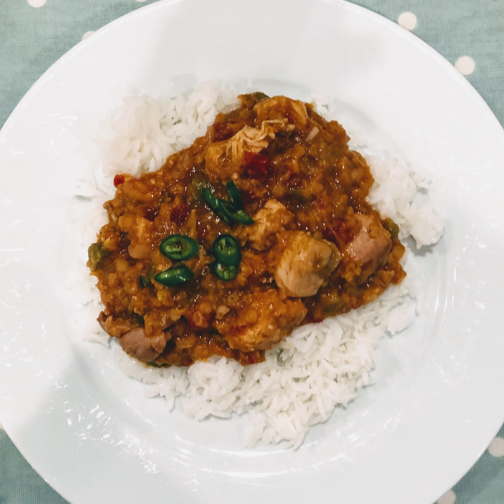

Chicken Dhansak
======================

Wonderful spicy persian/gujarati stew.

Ingredients
-----------
- 1 green bell pepper, diced
- 1 large onion, finely chopped
- 3 x chicken breast or equivalent amount chicken thighs, diced
- 2 garlic cloves, pressed/finely diced
- 20g ginger, grated
- 1 tbsp garam masala
- 1-4 serrano chilli pepper(s), finely diced
  - 1: mild, 4 (incl seeds): spicy
- 400g tin chopped tomatoes
- 600ml chicken stock
- 150g dried red split lentils, rinsed and drained
- 2 bay leaves

Steps
-----
1. Toast the garam masala in a large frying pan
2. Add 2 tbsp oil to the spice and fry the onions ~5 minutes
3. Add the chicken to pan and brown, add garlic, ginger and chili pepper, fry 20 secs
4. Add tomatoes, lentils, stock and bay leaves. Bring to the boil and simmer lid on for 40 mins
5. Simmer lid off ~10 mins to thicken sauce.

Serving
-------
Serve with rice and sprinkle with coriander.
