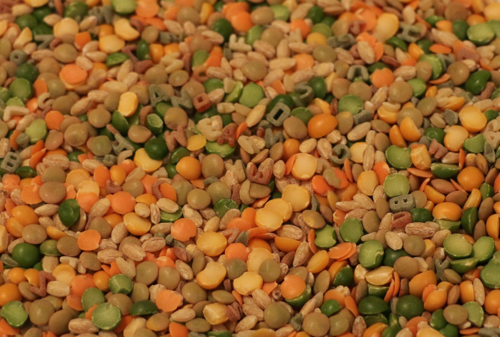

Northern irish vegetable soup
=============================

This recipe is apparently unique to Northern Ireland and uses soup/herb celery which is hard to find outside the area, but regular table celery can be substituted (including the leaves).

Ingredients
-----------
- 2 lbs beef shin or similar beef on bone
- 60g soup mix (30g barley, 15g red lentils, 15g split peas)
- 3 carrots
- 1 white onion
- field celery or 1 stalk celery, plus any leaves on the bunch
- 2 leeks
- 1 bunch parsley

Steps
-----
1. Place the beef in a large stock pot, cover with water and stew for 1 - 2 hours.
2. Allow the stock to cool, skim off any fat.
3. Add the soup mix to the stock, bring to the boil and simmer for 1 hour.
4. Roughly chop the leeks (green and white parts), onion, carrots, celery and parsley.  Add to the soup.  Season well and simmer until the vegetables are soft.

Serving
-------
Whole boiled potatoes are traditionally placed in the soup at time of serving.