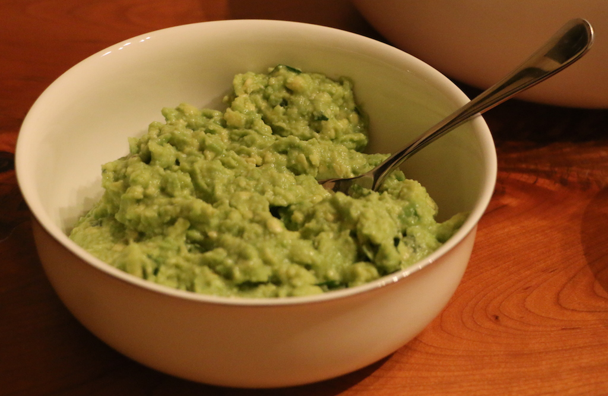
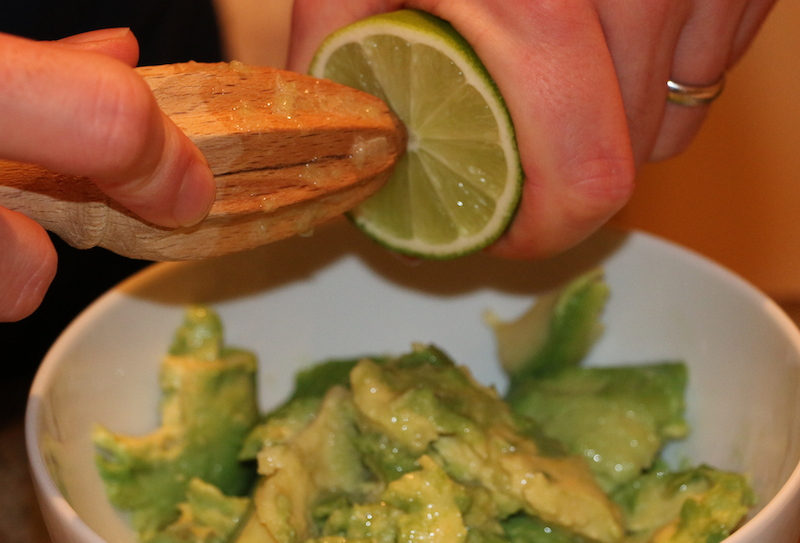

Super simple guacamole
======================

Some guacamole recipes call for many ingredients and can be a pain to prepare.  This super simple guac can be thrown together in a couple of minutes and tastes great.

Ingredients
-----------
- 2 ripe avocados
- 1 lime
- 2 tbsp cilantro

Steps
-----
1. Use a spoon to scoop the flesh of the avocados into a bowl.
2. Mash with a fork until fairly smooth and creamy.  Preserve some small solid chunks to add texture.
3. Add the juice of the lime.

4. Add the cilantro.
5. Mix thoroughly.