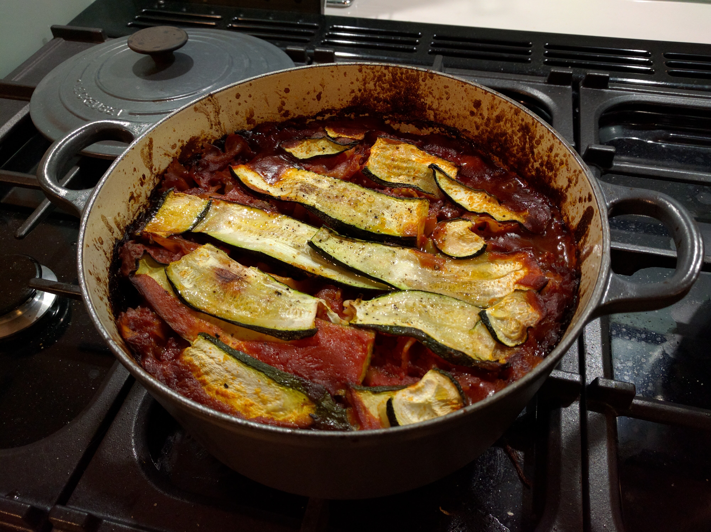
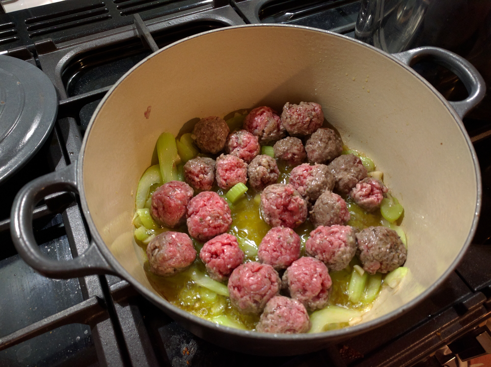
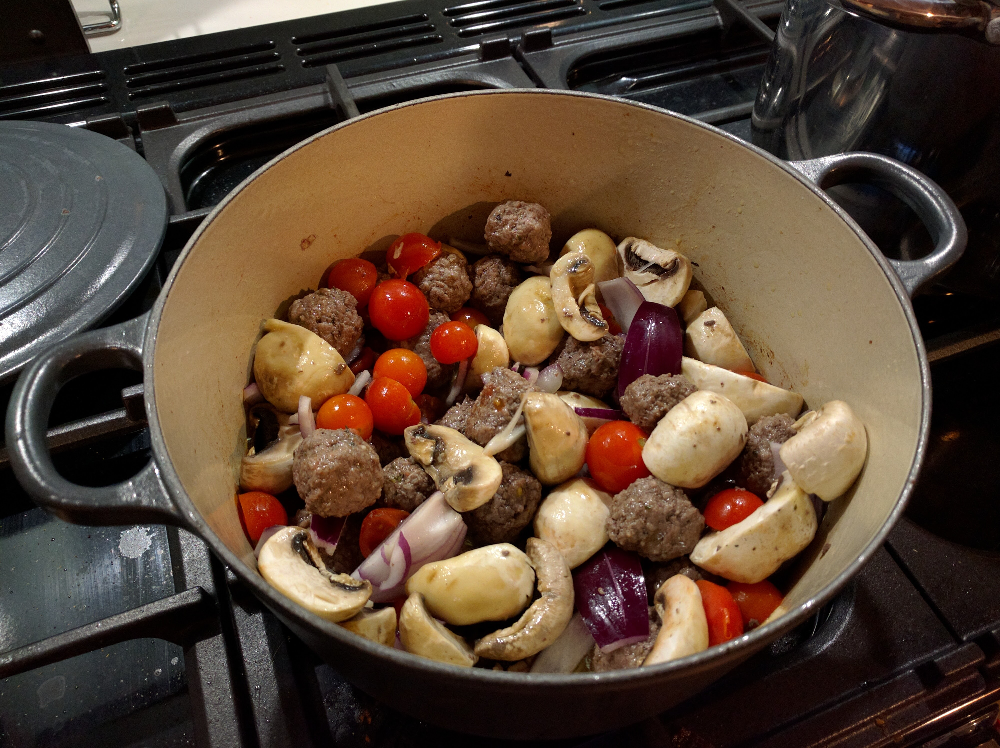
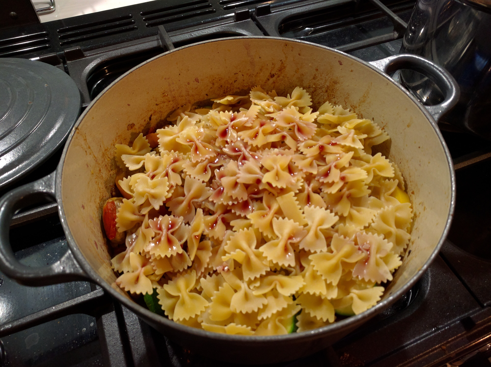
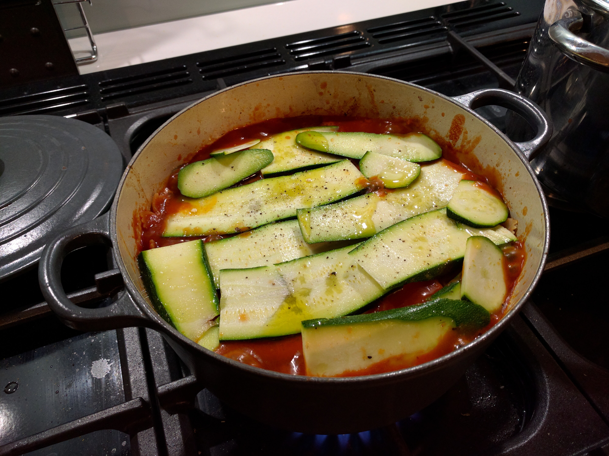
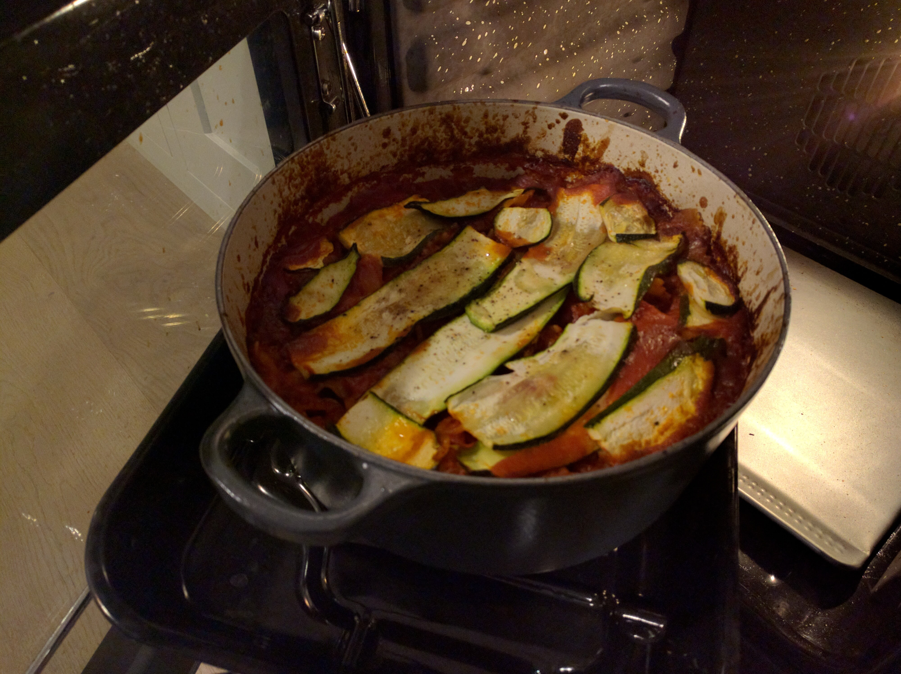

Zucchini and Meatballs pasta bake
======================

Delicious, cozy meatball dish.

Ingredients
-----------
- 500g lean ground beef
- 3 zucchini
- 1 red onion
- 2 cloves garlic
- 2 stalks celery
- 300g closed cup mushrooms
- 2 bell peppers
- 1 fresh chilli
- 250g dry farfalle pasta
- glug red wine
- 200g fresh cherry tomatoes
- 300g passata
- 4 tbsp olive oil

Steps
-----
1. Mince one clove of garlic and combine with the beef and 2 tbsp olive oil.  Season generously.
2. Roll the beef mixture into balls approx 1 inch in diameter
3. Finely slice the remaining clove of garlic and fry in 2 tbsp olive oil in a heavy oven proof dish until golden brown.
4. Add the celery, roughly chopped and the meatballs and cook until thoroughly browned.

5. Roughly chop the onions, mushrooms, tomatoes and two of the zucchini.
5. Add the chopped onion, mushrooms, tomatoes and zucchini and fry for a further 5 mins.

6. Add the bell peppers and a glug of red wine.  Stir.
7. Add the dry pasta in a layer on top of the rest of the ingredients.

8. Add the passata, ensuring that the pasta is completely covered - if more liquid required to cover, add a little water.
9. Slice the remaining zucchini wafer thin and lay on top cover the mixture, brush with olive oil.

10. Bake, lid off, in a 180 C / 350 F oven for 1 hour

